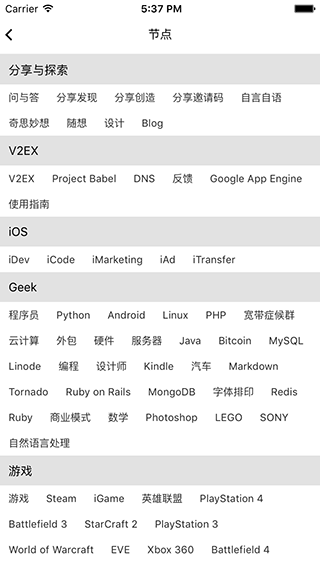
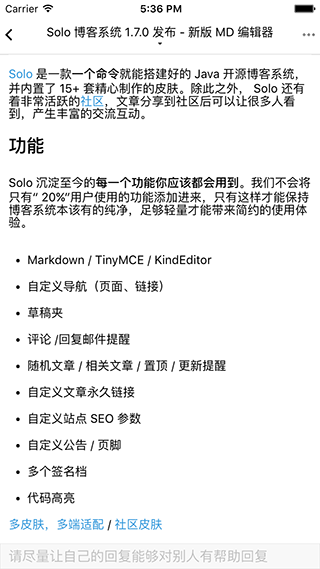

# 使用react native开发的V2EX客户端

> 由于个人喜欢在移动端浏览V2EX社区, 所以写的一个APP。
  支持iPad、iPhone、Android。

# 截图
 
 
 

# 功能
- [x] 登录/注销
- [x] 最新帖子列表
- [x] 多类目
- [x] 节点
- [x] 看帖/查看大图/回帖/赞/艾特
- [x] 分享
- [ ] 我的收藏
- [ ] 查看个人信息

# Build
1. clone this repo
2. npm install
3. react-native run-android or react-native run-ios

# 开发
1. redux数据管理
2. 模块化代码目录结构
3. html转换为RN View
4. html信息提取
5. 封装的loading、request、上下拉列表

#License
Apache License 2.0